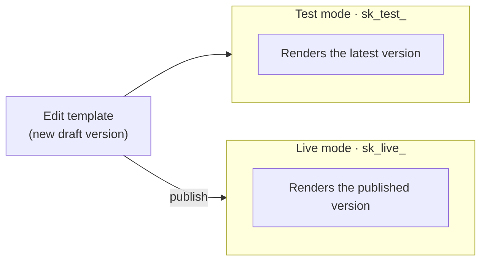

SenderKit runs in two modes — **test** and **live** — so you can wire up and exercise
sends without risking a real notification to a real person. You don't configure an
environment in code or pass a flag; the mode is decided by which API key you use.

## Test vs live

The key prefix selects the mode:

- **`sk_test_`** — test mode. SenderKit **never calls your providers**. It accepts the
  send, renders the template, and synthesizes a realistic delivery lifecycle so your
  logs and dashboards look exactly like production — but nothing reaches a real inbox,
  phone, or device.
- **`sk_live_`** — live mode. Sends are delivered for real through your
  [connected providers](/concepts/channels-and-providers).

The prefix is only a hint for humans; SenderKit derives the mode from the key
server-side, so the same code path behaves correctly just by swapping the key. See
[Authentication](/authentication) for how keys are created and managed.

```ts
// CI / local: nothing leaves the building.
const senderkit = new SenderKit({ apiKey: "sk_test_..." });

// Production: real delivery.
const senderkit = new SenderKit({ apiKey: "sk_live_..." });
```

Messages are isolated by mode — test sends and live sends are separate records, and
listing [messages](/concepts/messages) returns only those for the key's mode.

## How a version reaches live

There's no separate staging tier to promote through. You iterate in test mode (which
renders your **latest** draft) and, when it's ready, **publish** the version — that's
what makes it live. Publishing is the gate between the two modes.



<Warning>
  Test keys never call your providers, so you won't receive a real email, SMS, or
  push in test mode — that's by design. Switch to an `sk_live_` key to send for real.
</Warning>

<CardGroup cols={2}>
  <Card title="Versioning" icon="code-branch" href="/concepts/versioning">
    How publishing chooses the live version.
  </Card>
  <Card title="Authentication" icon="key" href="/authentication">
    Creating and rotating test and live keys.
  </Card>
</CardGroup>
