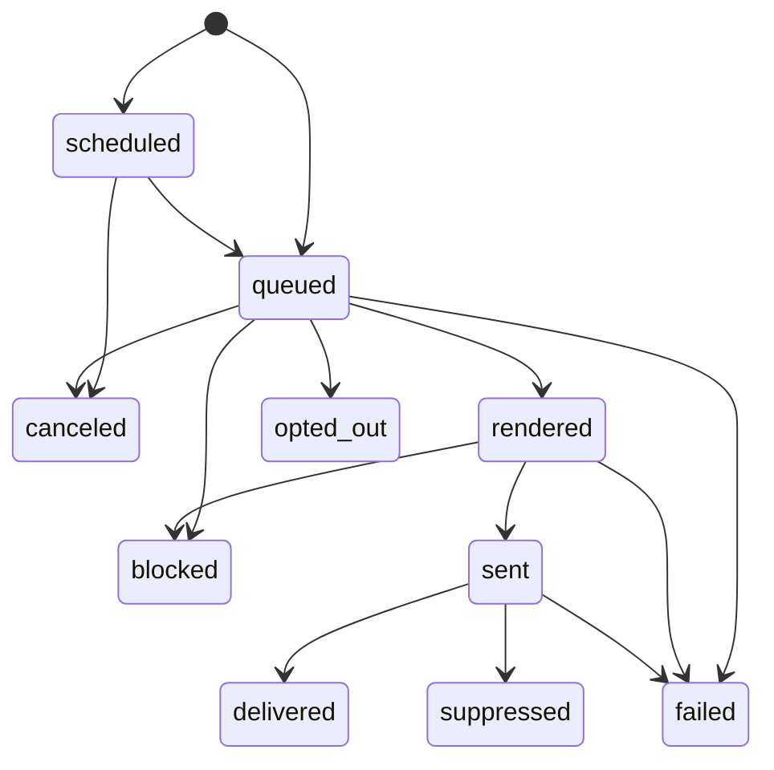

Every send creates a **message** — the record of truth for what SenderKit did with
it. A message captures the recipient, the channel, the variables, which provider
handled it, and a timeline of everything that happened. Because [sending is
asynchronous](/concepts/sending), the message is how you find out whether delivery
actually succeeded.

## The message lifecycle



| Status | What it means | What triggers it |
| --- | --- | --- |
| `scheduled` | Accepted but holding until `scheduledAt` | A `send()` with a future `scheduledAt` |
| `queued` | Accepted and ready to dispatch | The `send()` call, or a scheduled message reaching its fire time |
| `rendered` | Template + variables resolved | Background dispatcher |
| `sent` | A provider accepted the message | Successful provider dispatch |
| `delivered` | The provider confirmed delivery | Provider webhook |
| `failed` | Delivery failed | Provider webhook, a config error, or retries exhausted |
| `suppressed` | The provider rejected the recipient before delivery was attempted | Managed sending only — AWS SES email validation rejects an invalid or previously-bounced recipient pre-dispatch |
| `opted_out` | Recipient had already opted out | Send skipped before dispatch because the recipient had a prior unsubscribe or spam complaint on file |
| `blocked` | Delivery halted by outbound abuse detection | Phishing scan flagged the content with high confidence; the message is never handed to a provider. The message timeline records a generic notice; detection details are operator-only and not exposed via the customer API. |
| `canceled` | Delivery intentionally stopped before dispatch | `messages.cancel()` or the dashboard cancel action |

<Note>
  The status enum also includes `dispatched`. In the current pipeline a message moves
  `queued → rendered → sent`, and the moment a provider accepts it is recorded as a
  `dispatched` **event on the message's timeline** while the status itself becomes
  `sent`. Read `sent` as "handed to the provider."
</Note>

<Note>
  `opted_out` reflects **only** a send skipped before dispatch because the
  recipient had already opted out. If a recipient unsubscribes or complains
  *after* a message reached a terminal outcome (`delivered` or `failed`), that
  outcome is unchanged — the unsubscribe/complaint is recorded and reported via
  [webhook events](/webhooks#events), but it no longer overwrites a delivery
  result that already happened.
</Note>

In [test mode](/concepts/environments), SenderKit synthesizes this lifecycle
(`rendered → sent → delivered`) without calling a provider, so your logs look the same
as live without anything leaving the building.

## Querying messages

List messages newest-first with cursor pagination, and filter by `status`, `channel`,
`template`, or your own `metadata`. A `search` param does a case-insensitive substring
match over the message id, recipient, template, and your `metadata` keys/values:

```ts
const { data, nextCursor } = await senderkit.messages.list({
  status: "failed",
  channel: "email",
});
```

The API also supports a live tail (a Server-Sent Events stream) for watching sends in
real time. See the [API Reference](/api-reference/introduction), the
[TypeScript SDK](/sdks/typescript), and the [CLI](/cli/messages) for the full surface.

<Tip>
  Attach `metadata` (e.g. `{ userId: "usr_123", orderId: "ord_9" }`) when you send.
  It's indexed, so you can later filter messages down to a single user or order.
</Tip>

## Engagement (opens & clicks)

For email, SenderKit also records provider-reported **opens** and **link
clicks** as `openedAt` / `clickedAt` on the message — each set once, on the
first occurrence. These are engagement signals, not lifecycle states: they
never change a message's `status`, and `delivered` remains the terminal
happy-path status regardless of whether the recipient later opens it or clicks
a link.

Subscribe to the `message.opened` / `message.clicked` [webhook events](/webhooks)
to be notified as they happen, or read the fields directly via
`messages.get`/`messages.list`.

## Retention

Messages are retained for a limited window and then deleted:

| Plan    | Retention |
| ------- | --------- |
| Free    | 3 days    |
| Starter | 30 days   |
| Pro     | 90 days   |

<Warning>
  Don't treat SenderKit as your long-term audit log. If you need history beyond your
  plan's retention window, export or persist messages in your own system, and use
  `metadata` to correlate them with your records.
</Warning>

<CardGroup cols={2}>
  <Card title="Sending" icon="paper-plane" href="/concepts/sending">
    How a message gets created and dispatched.
  </Card>
  <Card title="Channels & Providers" icon="tower-broadcast" href="/concepts/channels-and-providers">
    Who delivered the message and how failures surface.
  </Card>
</CardGroup>
