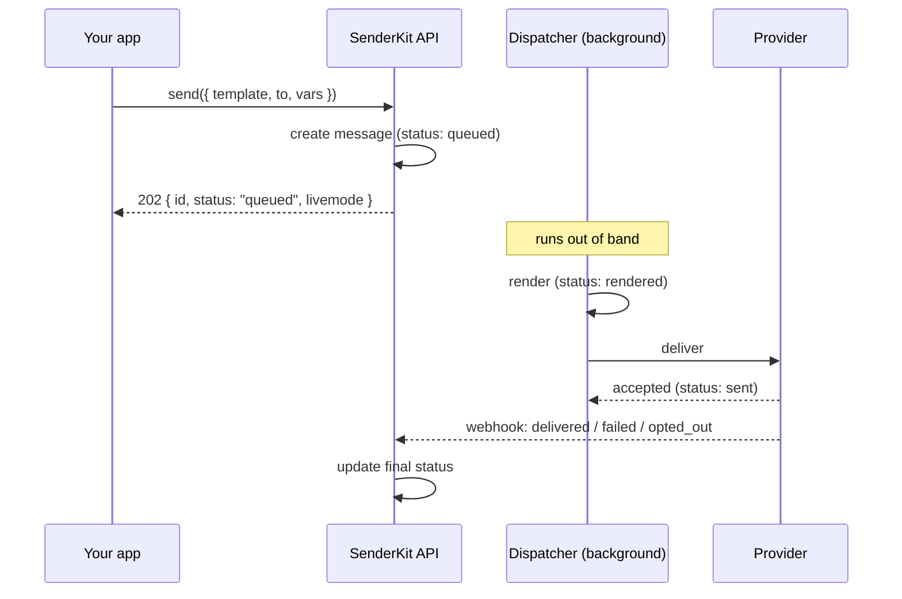

`send()` does not wait for your email to land. It's a fast, durable **enqueue**: the
call returns as soon as SenderKit has accepted and recorded the message, and delivery
happens in the background. Understanding that split — accept now, deliver later — is
the key to using SenderKit correctly.

## Synchronous accept, asynchronous delivery

A send returns `202` almost immediately with a message `id`, a `status` of
`"queued"` (or `"scheduled"` if you passed a future `scheduledAt`), and `livemode`.
That response means **accepted**, not **delivered**. SenderKit then renders the
template, dispatches to a [provider](/concepts/channels-and-providers), and updates
the message as the provider reports back.



```ts
const result = await senderkit.send({
  template: "welcome",
  to: "user@example.com",
  vars: { name: "Ada" },
});
// { id: "msg_…", status: "queued", livemode: false }
```

To find out what happened next, watch the [message](/concepts/messages) — poll
`GET /v1/messages` or tail the live stream.

## Scheduling sends

Pass a future `scheduledAt` (ISO 8601 string with offset, or a `Date`) to defer
delivery. The send is accepted immediately with `status: "scheduled"`; SenderKit
holds the message until the fire time, then dispatches it through the normal
pipeline.

```ts
await senderkit.send({
  template: "trial-ending",
  to: "user@example.com",
  scheduledAt: "2026-06-01T09:00:00Z",
});
// { id: "msg_…", status: "scheduled", livemode: false }
```

Constraints: `scheduledAt` must be in the future (with a few seconds of clock-skew
tolerance) and no more than 30 days out. Omit it to send immediately.

## Template sends and raw sends

Most sends reference a stored template by slug. You can also send **raw** content
inline — supply a `channel` and `content` instead of a `template` — for one-off
messages that don't warrant a template. Raw content is interpolated with your `vars`
only when you opt in; otherwise it's delivered verbatim. (A send specifies a
`template` **or** `content`, never both.)

## Idempotency

Because the network is unreliable and the SDK retries transient failures, the same
send can hit the API more than once. An **idempotency key** makes that safe: a repeat
key within your workspace returns the original message instead of creating a duplicate.

The SDK attaches an `Idempotency-Key` header automatically (it generates one if you
don't pass `idempotencyKey`), so retries don't double-send out of the box. Pass your
own key when the natural unit of work is something you can name:

```ts
await senderkit.send({
  template: "welcome",
  to: email,
  vars: { name },
  idempotencyKey: `welcome:${email}`,
});
```

<Tip>
  Use a stable, meaningful key for sends that must happen at most once — e.g.
  `receipt:${orderId}`. Then a retry, a duplicate webhook, or a double form submit
  collapses to a single message.
</Tip>

## Email deliverability

SenderKit applies two automatic behaviors to every email send (template and raw)
that improve inbox placement and comply with bulk-sender requirements:

**Multipart delivery (HTML + plain text)**

Every email ships as `multipart/alternative`: an auto-generated plain-text body
is derived from the final HTML at send time (after template variables and
reusable blocks are applied). HTML-only mail scores worse with spam filters; the
auto-generated part keeps the plain-text copy in sync with the HTML without
requiring you to maintain it manually.

For raw sends (`sendRaw` / `senderkit_send_raw`), you can supply your own `text`
field to override the auto-generated version.

**List-Unsubscribe headers (RFC 8058)**

All non-system email sends include `List-Unsubscribe` and
`List-Unsubscribe-Post: List-Unsubscribe=One-Click` headers, required by Gmail
and Yahoo for bulk senders. When a recipient uses the one-click unsubscribe
link, SenderKit records the opt-out and skips future sends from your workspace
to that address — the skipped messages are recorded with status `opted_out`.

<Note>
  Opt-out suppression is workspace-scoped: an opt-out in workspace A does not
  block sends in workspace B. It applies to all email from your workspace,
  not per-template.
</Note>

## Ordering and batching

Delivery is concurrent and out of band, so **send order is not delivery order** —
don't depend on two sends arriving in sequence. To send many messages at once, the
SDK's `sendBatch` fans out with bounded concurrency; each item becomes its own
message with its own idempotency key.

<Warning>
  A `202` / `"queued"` response means SenderKit accepted the message — not that it was
  delivered. Treat delivery as confirmed only when the
  [message](/concepts/messages) reaches a terminal status.
</Warning>

<CardGroup cols={2}>
  <Card title="Messages" icon="list-check" href="/concepts/messages">
    Track a send from queued to delivered.
  </Card>
  <Card title="TypeScript SDK" icon="js" href="/sdks/typescript">
    `send`, `sendRaw`, and `sendBatch` in detail.
  </Card>
</CardGroup>
