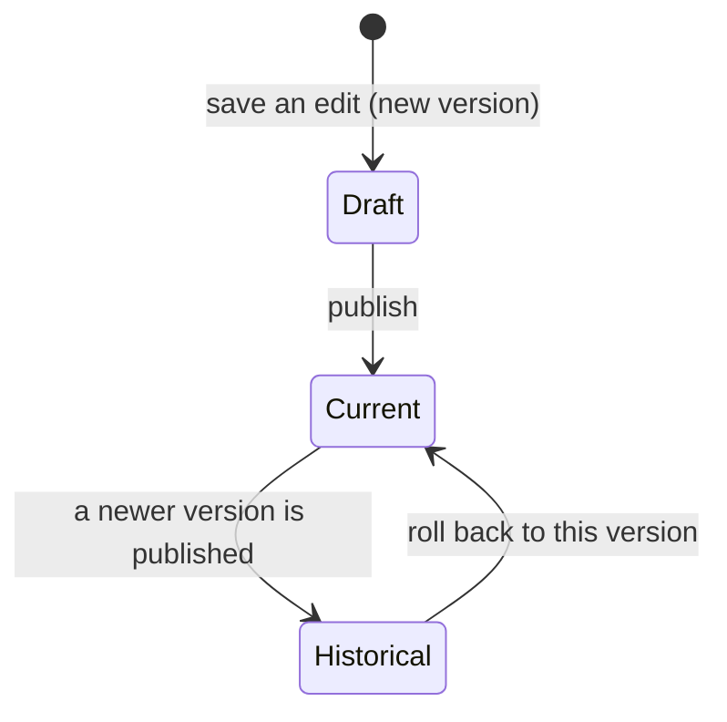

Editing live transactional copy is risky — a broken merge tag or a wrong link goes
straight to real users. SenderKit makes every edit **safe and reversible**: saving a
change never overwrites anything. It creates a new, immutable version. One version is
"current" (published and live); the rest are history you can return to instantly.

## The version lifecycle



- **Draft** — saving an edit creates a new version with the next sequential number.
  It isn't live yet.
- **Current** — publishing a version points the template at it. This is the version
  live sends render.
- **Historical** — once a newer version is published, the previous one becomes
  history. Its content is preserved exactly, so rolling back is lossless.

## How a send picks a version

A send normally doesn't name a version — SenderKit resolves one based on
[environment](/concepts/environments):

| Situation | Version rendered |
| --- | --- |
| `version` pinned on the send | That exact version number |
| Live mode (`sk_live_`), no pin | The template's **current published** version |
| Test mode (`sk_test_`), no pin | The **latest** version (your newest draft) |

That difference is deliberate: in test mode you render your newest draft so you can
iterate, while live traffic only ever renders what you've explicitly published.

```ts
// Render whatever is published (live) or latest (test):
await senderkit.send({ template: "welcome", to });

// Pin an exact version regardless of environment:
await senderkit.send({ template: "welcome", to, version: 3 });
```

<Note>
  In live mode a template with no published version returns
  `404 template_not_published`. Publish a version before sending it for real.
</Note>

## Rolling back

A rollback re-points the template's current version at an earlier one. Because
versions are immutable, the old copy is exactly as it was — nothing is reconstructed,
no new version is created, and it takes effect immediately without a redeploy. If a
bad publish goes out, rolling back is a single action in the dashboard.

<CardGroup cols={2}>
  <Card title="Templates" icon="file-lines" href="/concepts/templates">
    The template owns a pointer to its current version.
  </Card>
  <Card title="Environments" icon="flask" href="/concepts/environments">
    Why test and live resolve versions differently.
  </Card>
</CardGroup>
